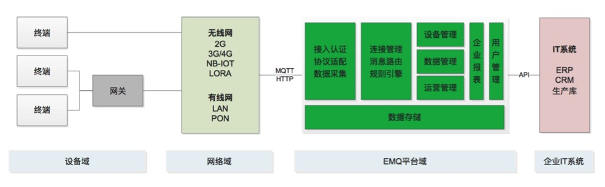

.. _overview:

=========
平台概述
=========
EMQ P 企业物联网网管平台为一站式平台系统，提供物联网设备接入、消息路由、数据采集与存储、数据分析、网络运维、业务运营等综合性功能；

EMQ P 企业物联网管平台搭载EMQ X企业版可串通整个物联网链路，为各种跨平台物联网应用、行业解决方案供物联网设备接入、消息路由、数据采集与存储、数据分析、网络运维、业务运营等服务。

EMQ P 企业用户、个人用户（创客）通过本产品无需或只需进行简单的二次开发，即能够快速实现对物联网应用的搭建、管理和运营，使企业和个人更加专注于应用；

--------------
平台架构示意图
--------------

