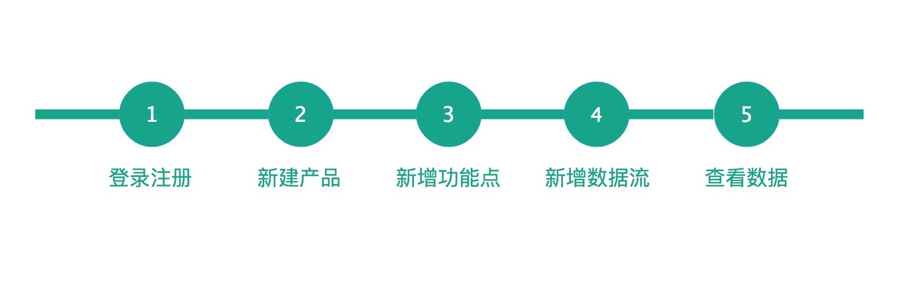

.. _quickstart:

========
快速开始
========

EMQ P 企业物联网网管平台为一站式平台系统，提供物联网设备接入、消息路由、数据采集与存储、数据分析、网络运维、业务运营等综合性功能；企业用户通过本产品无需或只需进行简单的二次开发，即能够快速实现对物联网应用的搭建、管理和运营。

========
术语解释
========

用户
>>>>
使用本平台的人员，对应IoT网络的运维人员、运营人员和IoT应用使用人员

产品
>>>>
对特定物联网功能进行抽象的集合体;

设备
>>>>
物联网终端或网关，为产品的一个实例；

数据流
>>>>>>
产品／设备能够产生或消费的业务信息报文；

功能点
>>>>>>
产品／设备具备最细粒度的能力或用途；

联动
>>>>
一类数据变化或一个动作直接导致一类数据变化或动作；

代理商
>>>>>>
厂家授权在某地区经销某种产品的商户或企业。

====
简介
====

本文档旨在描述对于终端设备接入使用EMQ P 企业物联网网管平台之前，在平台测需要做的准备工作，用户在初次使用EMQ P之前需要对平台的相关名词、流程了解。
下面详细介绍各个功能模块的使用，本介绍根据平台的体系架构来介绍，本平台可分为网络管理体系结构、业务运营体系结构、系统用户体系结构：

================
网络管理体系结构
================
用户在接入EMQ P之前，必须先在EMQ P平台注册用户账户，用户注册登录成功后，可以在用户账户下创建产品，目前平台提供有公开协议产品和私有协议产品两种产品类型（平台为公开协议产品又提供有HTTP、HTTPS、MQTT、CoAp、Webosckt等多种协议的选择）。可以通过产品创建多个功能点，任一功能点可组合成一条数据流，针对特定的数据流设置联动规则，触发对应的告警事件。在设备侧指定新增数据流。以完成数据采集、数据上传等工作，终端设备的数据上传成功后，平台在相应数据流下会生成随时间推移的数据点。EMQ P终端接入过程大致如下：

========
用户注册
========

>>>>>>

