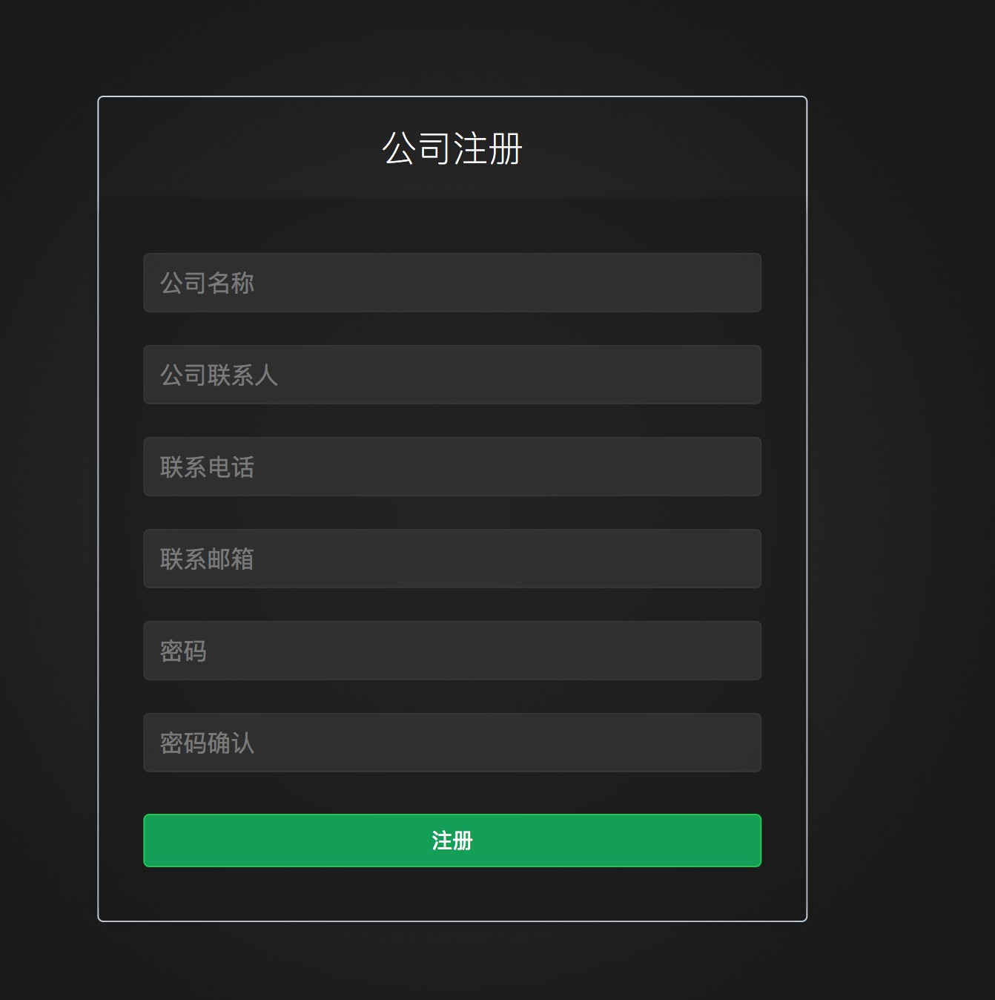
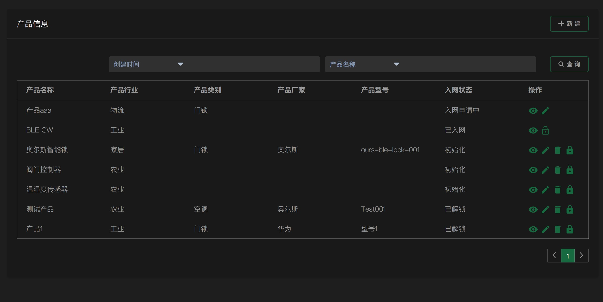
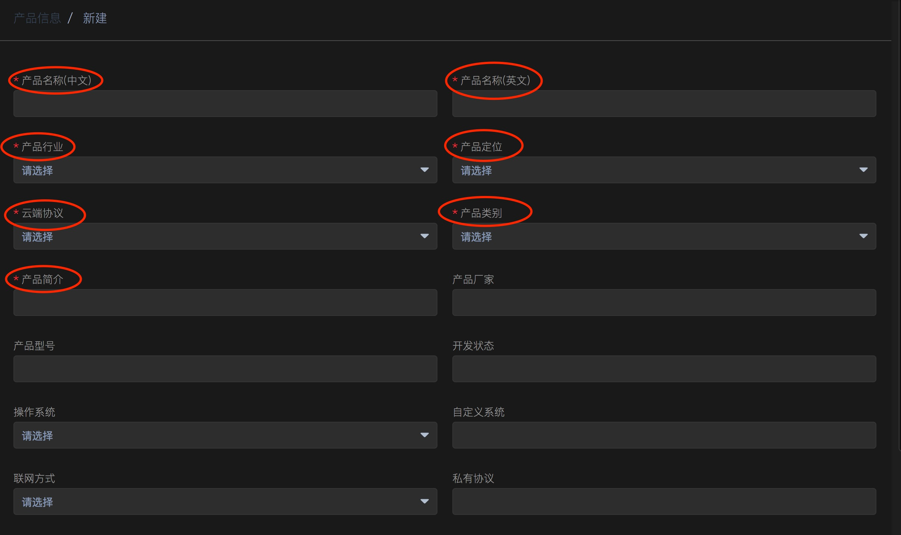
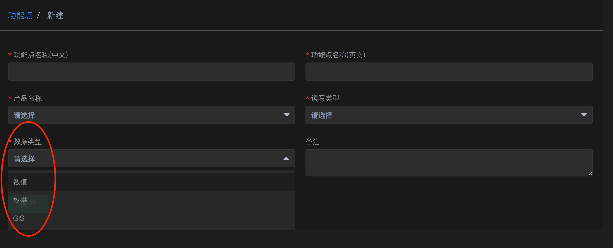

.. _quickstart:

========
快速开始
========

EMQ P 企业物联网网管平台为一站式平台系统，提供物联网设备接入、消息路由、数据采集与存储、数据分析、网络运维、业务运营等综合性功能；企业用户通过本产品无需或只需进行简单的二次开发，即能够快速实现对物联网应用的搭建、管理和运营。

========
术语解释
========

用户
>>>>
使用本平台的人员，对应IoT网络的运维人员、运营人员和IoT应用使用人员

产品
>>>>
对特定物联网功能进行抽象的集合体;

设备
>>>>
物联网终端或网关，为产品的一个实例；

数据流
>>>>>>
产品／设备能够产生或消费的业务信息报文；

功能点
>>>>>>
产品／设备具备最细粒度的能力或用途；

联动
>>>>
一类数据变化或一个动作直接导致一类数据变化或动作；

代理商
>>>>>>
厂家授权在某地区经销某种产品的商户或企业。

====
简介
====

本文档旨在描述对于终端设备接入使用EMQ P 企业物联网网管平台之前，在平台测需要做的准备工作，用户在初次使用EMQ P之前需要对平台的相关名词、流程了解。
下面详细介绍各个功能模块的使用，本介绍根据平台的体系架构来介绍，本平台可分为网络管理体系结构、业务运营体系结构、系统用户体系结构：

================
网络管理体系结构
================
用户在接入EMQ P之前，必须先在EMQ P平台注册用户账户，用户注册登录成功后，可以在用户账户下创建产品，目前平台提供有公开协议产品和私有协议产品两种产品类型（平台为公开协议产品又提供有HTTP、HTTPS、MQTT、CoAp、Webosckt等多种协议的选择）。可以通过产品创建多个功能点，任一功能点可组合成一条数据流，针对特定的数据流设置联动规则，触发对应的告警事件。在设备侧指定新增数据流。以完成数据采集、数据上传等工作，终端设备的数据上传成功后，平台在相应数据流下会生成随时间推移的数据点。EMQ P终端接入过程大致如下：

.. image:: _static/images/timing.png

========
用户注册
========

为了进入到EMQ P 平台，您需要在在EMQ P上注册一个公司账号，来创建企业的专属物联网网关平台；点击登录界面的“注册”，注册公司账号，填写公司名称、联系电话、邮箱地址(或者有效手机号码)等，完成注册后，可登录到EMQ P物联网管理平台：

========
产品创建
========

接入设备之前，需要先创建产品，进入产品管理模块，可对产品进行新建、入网管理等操作：

点击右上角，"新建"，在弹出页面中按照提示填写产品的基本信息，进行产品创建；

在创建过程中，请您按照提示尽可能完整、全面地填写相应内容，这样更方便您后期对产品进行管理；

在创建过程中，“云端协议”为必填字段, EMQ P提供多种协议和私有协议, 关于这些协议，请看下面详细介绍。

========
协议介绍
========

MQTT协议
>>>>>>>>

MQTT协议是一个面向物联网应用的即时通信协议，使用TCP/IP提供网络连接，能够对负载内容实现消息屏蔽传输，开销小，可以有效降低网络流量，协议的特点和功能包括：

- 长连接协议

- 终端数据点上报，支持的数据点类型包括：

    + 整型（int）

    + 浮点数（float）

    + 字符串（string）

    + JSON格式

- 平台消息下发

- 基于Topic的订阅、发布以及消息推送，可以实现设备间的消息单播以及组播。

HTTP/HTTPS协议
>>>>>>>>>>>>>

%%% TODO

CoAp协议
>>>>>>>>

%%% TODO

用户根据产品功能需求，选择支持的接入协议等，点击“保存”按钮，完成产品创建。创建完成后，返回到产品列表页面；

在产品列表页面会列出您创建的全部产品，可直接对各产品进行编辑、删除、入网申请等操作，也可以点击产品名称，进入该产品的管理页面；

至此，您已经在EMQ P上完成了产品的创建。

======
功能点
======

产品创建完成后，点击“产品管理”，进入功能点菜单，为产品新建一条功能点，点击右上角“新建”，进入以下新建功能点界面：

可根据不同的数据类型，级联出不同的数值要求，一个产品可以创建1个或多个功能点，以下是为“温湿度传感器”创建的关于“温度功能点”和“湿度功能点”两条功能点记录：

.. image:: _static/images/fun_sample1.png

.. image:: _static/images/fun_sample2.png

除了对功能点进行新建操作以外，用户还可以对已有的功能点进行修改、删除操作（对于已经入网的产品，删除功能点需要先解锁）。
